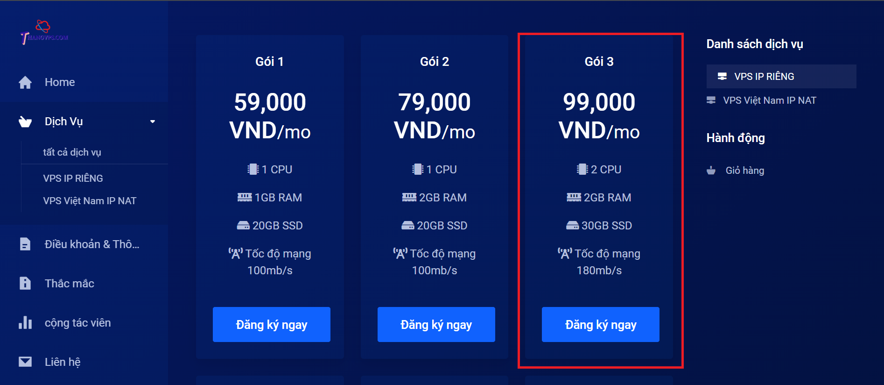
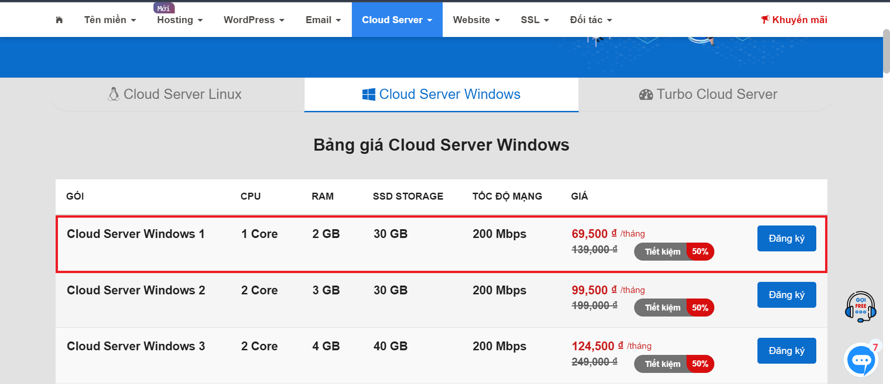
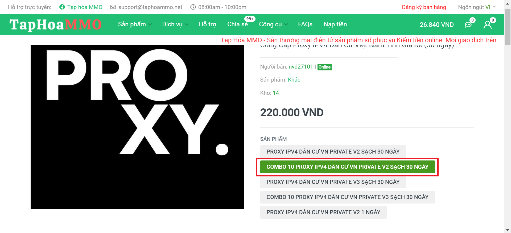
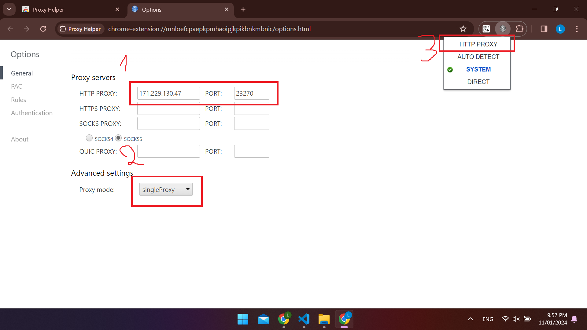
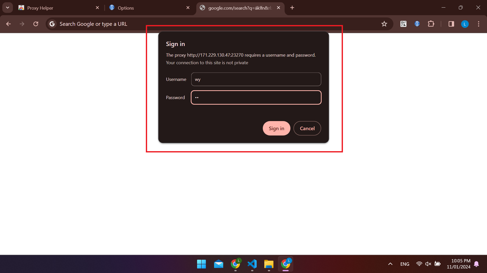
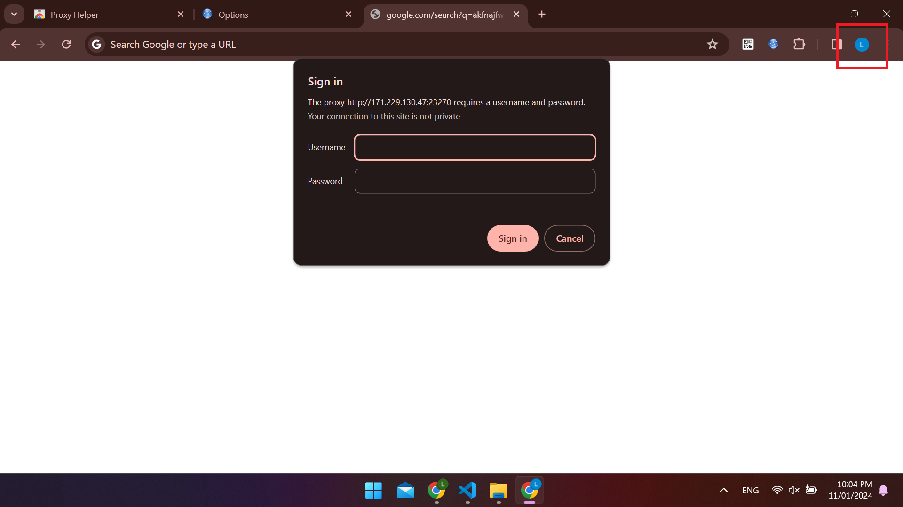

# Cách đào grass trên vps kết hợp proxy

Hiện tại thì mình đang chạy 12 tài khoản trên 2 vps kết hợp proxy với chi phí chỉ khoảng 350k, chi tiết hướng dẫn sẽ ở bên dưới, ae nào thiện chí thì nhấn [vào đây](https://app.getgrass.io/register/?referralCode=3rfSgfKhjh14XSv) cho mình xin vài ref nha 😆😆.

## Bước 1: Chuẩn bị vps

Hai vps mình đang dùng là thangvps (ip dân cư) và inet (ip datacenter), cả 2 đều dùng window 2019:

- thangvps: https://thangvps.com/store/vps-ip-ring
  
- inet: https://inet.vn/cloud-server?tab=windows
  

Sau khi thành toán thành công, ae kết nối bằng Remote Desktop Connection.

<strong>\* Lưu ý: ae nhớ update window sau đó restart lại. Nếu không thì không thể chạy được.</strong>

## Bước 2: Chuẩn bị proxy

Ae vào [taphoammo](https://taphoammo.net/gian-hang/cung-cap-proxy-dan-cu-viet-nam_119936) và mua con này:

Ae nên dùng private v1 hoặc v2:

- Đối với v1 tốc độ rất nhanh (mình chưa test), có lẽ hiện tại đang hết hàng
- Đối với v2 thì tốc độ sẽ random từ 45 - 85%
- Còn v3 thì mình nghĩ ae không nên dùng

Sau khi thanh toán thành công, ae nhấn vào biểu tượng chat phía trên bên phải, gửi mã đơn hàng của ae vào đó để nhận ip.

Ip ae nhận được sẽ có dạng như sau: `171.229.130.47:23270:wy:wy`

- ip: `171.229.130.47`
- port: `23270`
- tài khoản: `wy`
- mật khẩu: `wy`

## Bước 3: Thiết lập proxy

Bây giờ ae sẽ tại proxy helper về, sau khi tải thanh công nó sẽ tự động chuyển sang trang option cho ae: Ở bước 2 ae nhớ click vào chọn `singleProxy`.

Nhập tài khoản và mật khẩu vào đây:

Ae muốn treo thêm nhiều proxy thì nhấn vào đây để add account, không cần login cũng được.

<strong>Chúc ae chạy thành công 😆😆</strong>
