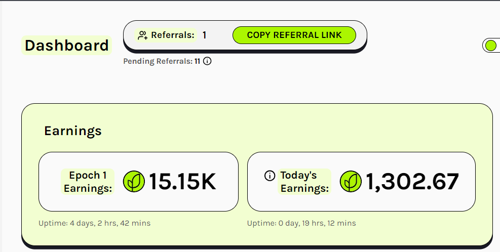
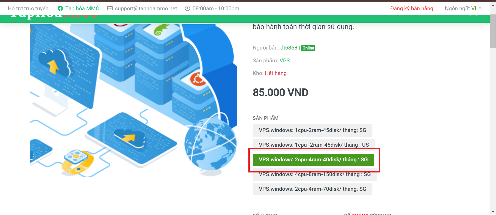
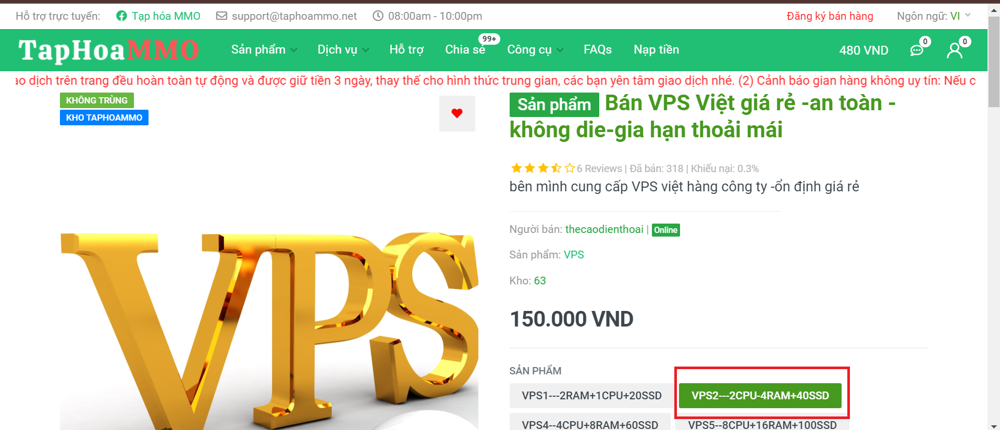
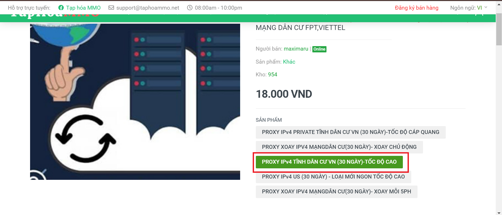
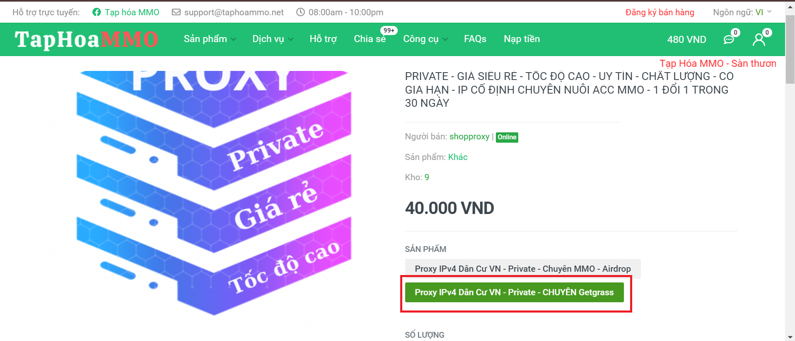
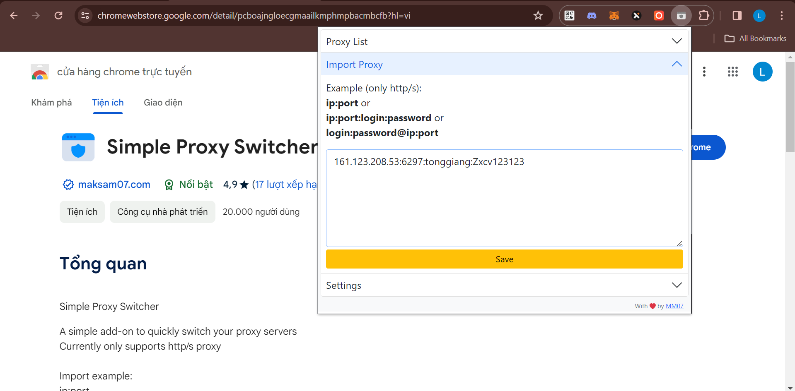
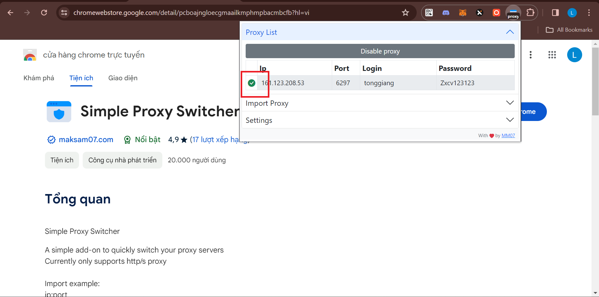

# Cách đào grass trên vps kết hợp proxy

Hiện tại với 360k, ae có thể chạy dc 6 tài khoản grass, chi tiết hướng dẫn sẽ ở bên dưới. Ae nào chưa có tài khoản có thể đăng ký [tại đây.](https://app.getgrass.io/register/?referralCode=3rfSgfKhjh14XSv)

## Bước 1: Chuẩn bị vps

Hai vps mình đang dùng:

- VPS1: https://taphoammo.net/gian-hang/cloud-vps-server-trial-nuoc-ngoai-gia-re-bao-hanh-1-oi-1_886061
  
- VPS2: https://taphoammo.net/gian-hang/ban-vps-viet-gia-re-an-toan-khong-die-gia-han-thoai-mai_980854
  

Sau khi thành toán thành công, ae kết nối bằng Remote Desktop Connection.

## Bước 2: Chuẩn bị proxy

Hai proxy mình đang dùng:

- Proxy1: https://taphoammo.net/gian-hang/proxy-ipv4-ipv6-xoay-tinh-vn-us-mang-dan-cu-fpt-viettel_73453
  
- Proxy2: https://taphoammo.net/gian-hang/proxy-ipv4-dan-cu-gia-re-toc-o-cao-chat-luong-cao_193855
  

## Bước 3: Thiết lập proxy

- Ae tải [Simple Proxy Switcher](https://chromewebstore.google.com/detail/pcboajngloecgmaailkmphmpbacmbcfb?hl=vi). Sau đó ae dán proxy vừa mua vào như ảnh dưới rồi chọn save:
  
- Sau đó check vào ô hình tròn là xong:
  

<strong>Chúc ae lụm ngàn đô 🚀🚀.</strong>
